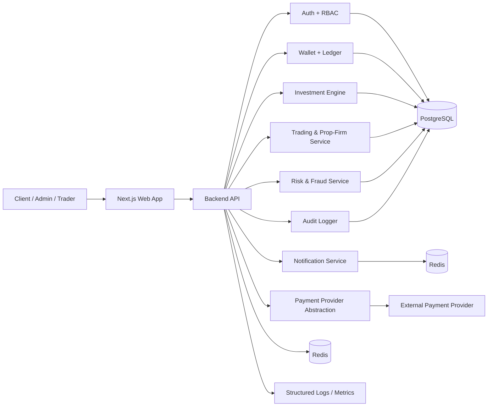

# STEP 1 — PRODUCT ARCHITECTURE

## 1. System architecture diagram

## 2. Technology stack

- Frontend: Next.js, React, TypeScript, Tailwind CSS, shadcn/ui-inspired component system
- Backend: Node.js + TypeScript, NestJS or Fastify
- Persistence: PostgreSQL with NUMERIC/DECIMAL-based accounting
- Cache/queues: Redis + BullMQ
- Auth: JWT + refresh token rotation + MFA support
- Observability: structured logging, Prometheus/Grafana-style metrics, health checks
- Deployment: Docker Compose for local development; Linux + Nginx + CI/CD for production

## 3. Component architecture

### Web application

- Public pages: landing, auth, onboarding, privacy policy, T&C, risk disclosure
- Authenticated user portal: dashboard, portfolio, investments, trading, transactions, withdrawals
- Admin portal: overview, users, KYC, deposits, withdrawals, trading, prop-firms, risk, reports, audit logs

### API layer

- REST API with versioned endpoints and OpenAPI docs
- Validation, rate limiting, RBAC enforcement, audit interceptors
- Service layer for ledger, investments, withdrawals, risk, payment verification

### Financial core

- Wallets and ledger are the source of truth for balances
- Investments are stateful with lifecycle events
- Profit/loss and fees are calculated from auditable ledger records
- No direct balance mutation without ledger entries

## 4. Database architecture

- PostgreSQL as transactional source of truth
- Separate logical domains: identity, KYC, wallets, ledger, investments, trading, prop-firm, audit
- Numeric precision for all financial amounts using DECIMAL / NUMERIC
- Relational model ensures integrity and auditable history

## 5. Authentication architecture

- Credential-based auth with Argon2 or bcrypt password hashing
- JWT access token and refresh token pair
- Refresh-token rotation, secure cookies, and session revocation support
- MFA/2FA and email verification paths
- Backend authorization guards enforce RBAC on every protected action

## 6. Financial ledger architecture

- The ledger is the authoritative accounting layer
- Each ledger entry is a signed transaction with debit and credit accounts
- Wallet balances are derived from ledger state instead of being trusted from frontend inputs
- Investment lifecycle transitions emit ledger entries for allocation, fee accrual, realized P/L, and maturity settlement
- This prevents silent balance edits and supports audit review

## 7. Trading architecture

- Trading accounts are modeled separately from user wallets
- Real-money broker and prop-firm accounts are tagged clearly
- Prop-firm accounts never count as user cash; their nominal funding is tracked separately from company capital
- Performance imports are append-only with immutable audit trail for corrections

## 8. Payment architecture

- Payment provider abstraction interface allows Stripe, Wise, Adyen, Plaid, or other providers in the future
- Webhook verification and server-side transaction validation are mandatory
- Provider transaction IDs, internal transaction IDs, and status tracking are retained
- Frontend cannot authorize payment success on its own

## 9. Security architecture

- API rate limiting and lockout policies
- CORS, secure headers, CSRF protection where required
- Input sanitization, SQL injection protection via parameterized queries, output encoding
- SSRF protections for outbound requests
- Secret management through environment variables and secure vaults in production
- Audit logs capture actor, action, resource, state changes, IP, and user-agent

## Security & compliance note

This system intentionally avoids guaranteeing returns or misrepresenting projected performance as cash. All investment performance is treated as configurable target outcomes and subject to market and strategy risk. Final legal/compliance review is required before live real-money operation.
