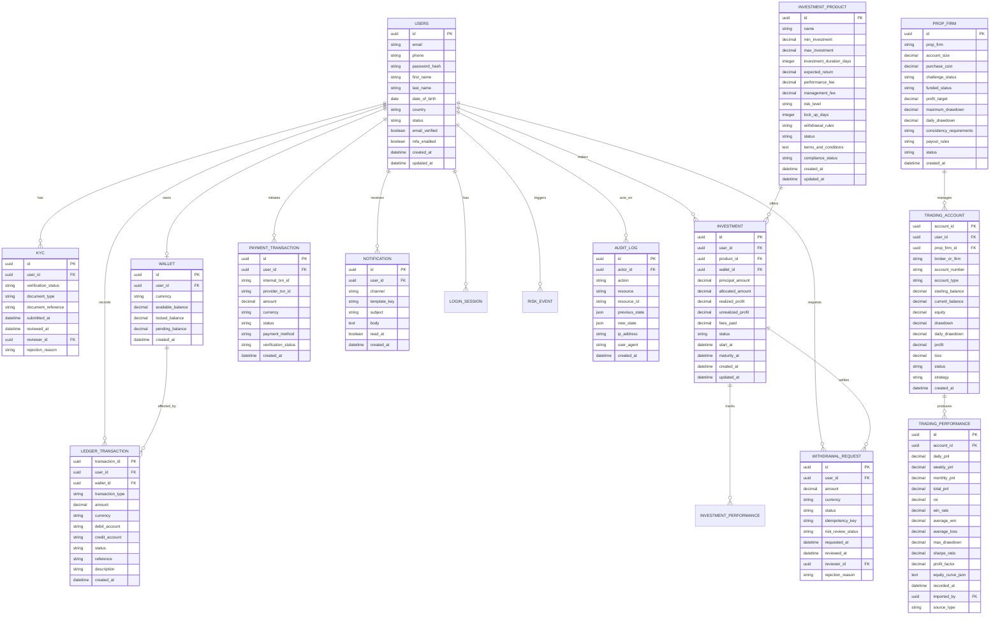

# STEP 2 — DATABASE ERD

## Core entities and relationships

## Key design principles

- Financial data is append-only and auditable
- Wallet balances are not edited directly; they are derived from ledger entries
- Trading/account performance data is either imported or manually recorded, but every correction creates a new audit record
- KYC documents are stored through secure object storage or encrypted vault references, not as free-form sensitive data in the main database
- Withdrawal requests enforce lock checks, idempotency, and state-machine validation
